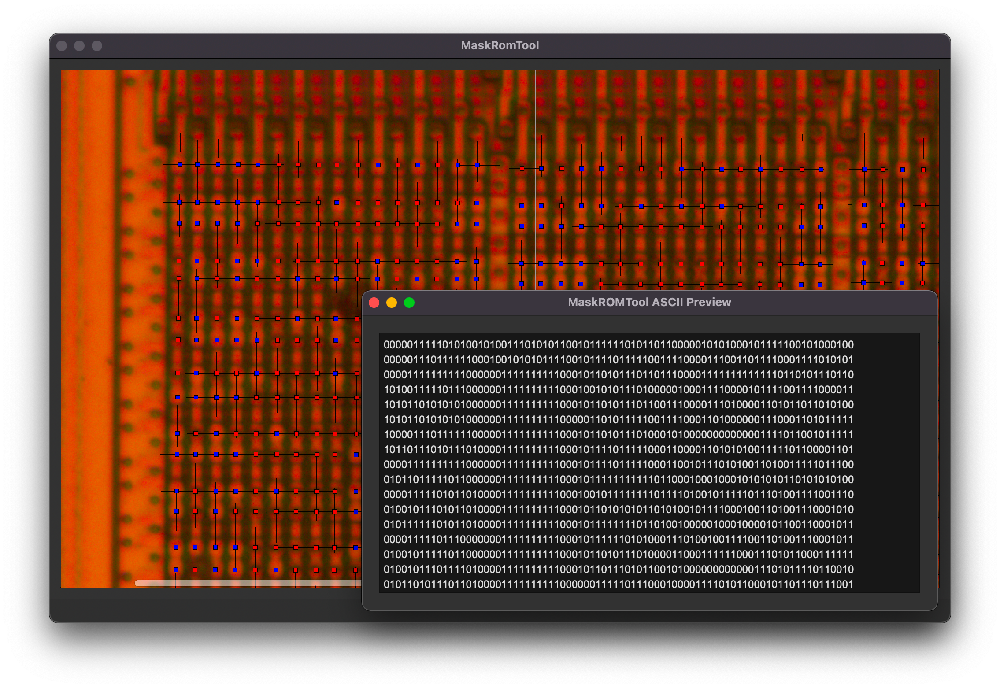
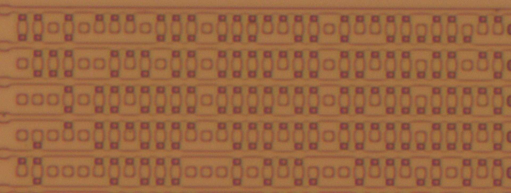
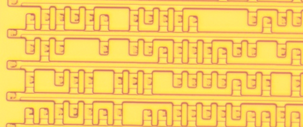

Howdy y'all,

This is my little CAD tool for taking photographs of a mask ROMs and
extracting the bits, so that the contents of the ROM can be recovered.

The keyboard shortcuts in this tool are *not* optional.  Please read
the GUI documentation below before starting to explore.

--Travis Goodspeed



## Examples

[gbrom-tutorial](https://github.com/travisgoodspeed/gbrom-tutorial)
teaches you how to begin with photographs of the GameBoy's mask ROM
and work your way to an accurate ROM image.

[MYK82 ROM](https://github.com/travisgoodspeed/myk82rom) holds a
completed dump of the ROM from the MYK82 chip in a Fortezza Card.
This is the successor to the Clipper Chip, and the repository includes
not just all ROM bits but also reshoots for error correction.

## Changelog

2023-07-20 -- Secondary display support.  Tall sampling.  Fixes
crash when hitting `V` after deleting a line.

2023-06-17 -- Added macOS on X86_64 and ARM64.

2023-05-30 -- First Windows release.

## Building

This tool works in Windows, Linux and MacOS, using QT6 with the
QtCharts extension.  Be sure to manually enable QtCharts in the [QT
Unified
Installer](https://download.qt.io/official_releases/online_installers/),
as it's not enabled by default!

Building the tool is easiest from the CLI.  In Debian Bullseye (11.x),
```
% sudo apt install make gcc g++ cmake git qt6-base-dev qt6-charts-dev \
qt6-translations-l10n linguist-qt6 qt6-l10n-tools qt6-tools-\* qt6-image-formats-plugins
% git clone https://github.com/travisgoodspeed/maskromtool/
...
% cd maskromtool
% mkdir build; cd build
% make -j 8 && sudo make install
```

In Windows and macOS, use the [Qt for Open
Source](https://www.qt.io/download-qt-installer-oss) installer, being
sure to include the Charts and Image Formats extensions.  Then open
`CMakeLists.txt` as a project.  `Ctrl+B` will then compile
`maskromtool`.  If you have a problem with your import, such as
choosing the wrong Qt installation, delete `CMakeLists.txt.user` and
reopen the project to try again.

For the convenience of Windows and macOS users, we have also made some
[Prebuilt
Releases](https://github.com/travisgoodspeed/maskromtool/releases).

## High Level Design

I've designed the GUI around a `QGraphicsScene`.  The underlying data
objects use the QT coordinate system, with floats for
better-than-pixel precision.

After loading a ROM photograph, the user places Columns and Rows onto
the photograph.  Every intersection of a Column and a Row is
considered to be a Bit, and a configurable color threshold determines
the value of that Bit.  Where the photograph is misread, you can also
Force the bit to a known value.

Once all of the Bits have been marked and the Threshold chosen, the
software will mark every light bit as Blue (0) and every dark bit as
Red (1).  These bits are then Aligned into linked lists of rows for
export as ASCII, for use in other tools.

To identify errors, a set of Design Rule Checks (DRC) will critique
the open project.  While the primary interface is the GUI, a CLI is
also available for scripting and testing.

## GUI Usage

First use File/Open ROM to open a ROM image as a photograph.  Try to
use uncompressed formats, but beware that macOS doesn't like TIFF
files.

Holding the control key (command on macOS) while rolling the mouse
wheel will zoom in and out.  You can also pinch-zoom on a track pad.
Dragging with the middle button will pan, or scroll with two fingers
as your operating system likes.

By arbitrary convention, the bits should be in long columns with shorter
rows.  If decoder lines are visible, they ought to be at the top of
the image.  Feel free to photograph it one way, then rotate it for
markup.

When you save your project, the image's filename will be extended with
`.json`.  This sorted and indented JSON file should be appropriate for
use in version control, such as Git repositories.

These keyboard buttons then provide most of your input.  For drawing
lines, first click once to choose as start position and then press the
key when the mouse is above the end position.  Deleting an item or
Setting its position will apply to the most recently placed line,
unless you drag a box to select a line.

The most recent object is already selected, so you can remove a
mistake with `D` or adjust its position a little with `S`.

```
Tab     -- Show/Hide bits.
Q       -- Zoom to zero.
A       -- Zoom in.
Z       -- Zoom out.
H       -- Jump to home position.
SHIFT+H -- Set the home position.

D       -- Delete the one selected object.
SHIFT+D -- Delete all selected objects.
S       -- Set the selected object to the mouse position.
F       -- Jump to the selected item.

R       -- Draw a row from the last click position.
SHIFT+R -- Repeat the shape of the last row.
SPACE   -- Repeat the shape of the last row.
C       -- Draw a column from the last click position.
SHIFT+C -- Repeat the shape of the last column.

SHIFT+F -- Force a bit's value. (Again to flip.)
SHIFT+A -- Force a bit's ambiguity.  (Again to flip.)

M       -- Remark all of the bits.
V       -- Run the Design Rule Checks.
SHIFT+V -- Run all the Design Rule Checks.
```

When you first begin to mark bits, the software won't yet know the
threshold between a one and a zero.  You can configure this with
`View` / `Choose Bit Threshold`.

Even the best bits won't all be perfectly marked, so use `SHIFT+F` to
force bit values where you see that the software is wrong.  `SHIFT+A`
is similar, and marks a bit as being ambiguous or damaged.  The `DRC`
menu contains Design Rule Checks that will highlight problems in your
project, such as weak bits or broken alignment.

The crosshairs will adjust themselves to your most recently placed row
and column.  This should let them tilt a little to match the reality
of your photographs.

After you have marked the bits and spot checked that they are accurate
with DRC, run File/Export to dump them into ASCII for parsing with
other tools, such as
[Bitviewer](https://github.com/SiliconAnalysis/bitviewer) or
[ZorRom](https://github.com/SiliconAnalysis/zorrom).


## CLI Usage

In addition to the GUI, this tool has a command line interface that
can be useful in scripting.  Use the `--help` switch to see the latest
parameters, and the `--exit` switch if you'd prefer the GUI not stay
open for interactive use.

```
dell% maskromtool --help
Usage: maskromtool [options] image json
Mask ROM Tool

Options:
  -h, --help                 Displays help on commandline options.
  --help-all                 Displays help including Qt specific options.
  -v, --version              Displays version information.
  -V, --verbose              Print verbose debugging messages.
  --stress                   Stress test bit marking.
  -e, --exit                 Exit after processing arguments.
  --opengl                   Enable OpenGL.  (Not yet stable.)
  -d, --drc                  Run default Design Rule Checks.
  -D, --DRC                  Run all Design Rule Checks.
  --sampler <Default>        Bit Sampling Algorithm.
  --diff-ascii <file>        Compares against ASCII art, for finding errors.
  -a, --export-ascii <file>  Export ASCII bits for use in ZorRom.
  --export-csv <file>        Export CSV bits for use in Matlab or Excel.
  --export-json <file>       Export JSON bit positions.
  --export-python <file>     Export Python arrays.
  --export-marc4 <file>      Export MARC4 ROM banks, left to right.
  --export-arm6 <file>       Export ARM6L (MYK82) ROM.
  --export-photo <file>      Export a photograph.

Arguments:
  image                      ROM photograph to open.
  json                       JSON lines to open.
```

To run without a GUI, pass `-platform offscreen`.  If the program
crashes under Wayland, force Xorg usage by passing `-platform xcb`.

On Windows, it's awkward for an executable to have a GUI while
retaining a log on the CLI.  We solve this by producing two
executables; please use `maskromtool.exe` for the GUI and
`maskromtoolcli.exe` for the CLI.


## Correcting Bit Errors

While a few thousand bits might be marked without an error, larger
projects will inevitably need to manage their mistakes.

A good start is to use the DRC checks and careful configuration of the
bit thresholds until no obvious errors remain.  Then navigate the
project and hit the `tab` key to show and hide the annotations, making
sure that each bit is recognized properly.

When that is insufficient, such as for ROMs that are tens or hundreds
of kilobits, it helps to annotate the same ROM multiple times,
preferably from different photographs.  Bit errors will happen in
annotating each photograph, of course, but they will happen in
different places.  You can then use the `--diff-ascii` feature against
the output of `--export-ascii` to compare images, reconciling their
differences until all of your project files agree.

## Correcting Alignment Errors

This tool first marks the positions of the bits, then sorts them by
the X coordinate to try and identify all of the bits in the leftmost
column.  If that works, it can then bucket all bits to the right,
forming a linked list of each row.

But sometimes it goes wrong because it can't quite figure out when the
first column ends.  Then the buckets don't fit, and you wind up with
wildly different counts for each row.

Use the `Edit/Alignment Constraints` menu in the GUI to change the
number of bits in a row from the *wrong* column can be seen before the
algorithm gives up on searching for new bits in the first row.  If the
default of 5 is not appropriate, you probably want 0 when columns do
not overlap at all or 20 when there is significant overlap.

A better alignment algorithm might fix this, and it is tracked in
[issue 22](https://github.com/travisgoodspeed/maskromtool/issues/22).

## Sampling Algorithms

Most ROMs can be read simply by reading the color of a single pixel at
the bit's center.  For those, the `Default` sampling algorithm will
work just fine.



For diffusion ROMs whose bits have better a little too delayered, the
center of the bit does not have a unique color, but it is surrounded
by slightly darker lines.  The `Wide` algorithm will take the darkest
color in each channel after sampling its size worth of bits in width,
and `Tall` does the same but vertically.



## Development

Patches and improvements to Mask ROM Tool are most welcome, but please
do not spam the issue tracker with feature requests.  Pull requests
should be submitted through the Github page, and they should not
entangle the project with dependencies upon third-party libraries.

We will keep Qt5 compatibility until Debian begins to drop it for Qt6,
so please try to test your patch on both platforms.

The code is written in a conservative dialect of C++, with minimal use
of advanced features.  I've tried to comment the code and the class
definitions thoroughly.


## ROM Decoders

**ASCII** exports for
[Bitviewer](https://github.com/SiliconAnalysis/bitviewer) and
[ZorRom](https://github.com/SiliconAnalysis/zorrom).  If your chip is
not supported by Mask ROM Tool, you almost certainly want to export
the bits to ASCII and explore them with these two tools until they
make sense.

**CSV** exports as a Comma Separated Value file.  In Matlab or Octave,
`csvread("foo.csv")` imports the data.  In Excel, you can just open
the file.

**JSON** export of bit positions and values.  This is far more verbose
than ASCII, but might be useful if you wanted to write your own tool.

**Python** export provides you with an array of the bits, for writing
your own parsing scripts.

**Photograph** export provides a `.png` file of the current project.
It's useful for documenting your work.

**ARM6** exports bytes from ARM's ARM6L SoC devices, which are encoded
as sixteen 32-bit words per row, most significant bits on the right.
This was designed for the MYK82 chip in a Fortezza card, but might
work elsewhere.

**MARC4** exports for Atmel's 4-bit architecture by the same name.
For now, this dumps the pages from left to right, so you'll need to
rearrange the pages manually until
[marc4dasm](https://github.com/AdamLaurie/marc4dasm) is happy.  Read
Adam Laurie's [Fun With Masked
ROMs](http://adamsblog.rfidiot.org/2013/01/fun-with-masked-roms.html)
for more details on the format.

Pull requests for new export formats are more than welcome.

## Related Tools

John McMaster's [ZorRom](https://github.com/SiliconAnalysis/zorrom) is
the best decoder available.  You will probably use ZorRom to decode
the ASCII output of physical bits from MaskRomTool into a file of
logical bytes.

Adam Laurie's [RomPar](https://github.com/AdamLaurie/rompar) might be
the very first bit marking tool to be open sourced.

Chris Gerlinsky's
[Bitract](https://github.com/SiliconAnalysis/bitract/) is another open
source tool for bit marking, and
[Bitviewer](https://github.com/SiliconAnalysis/bitviewer) is his
matching tool for decoding bits to bytes.

Peter Bosch's [PLA Decode](https://github.com/peterbjornx/pladecode)
is a bit marking tool used for extracting old Intel microcode.  See
his [Hardwear.io](https://www.youtube.com/watch?v=4oFOpDflJMA) talk
from 2020 for more details.

